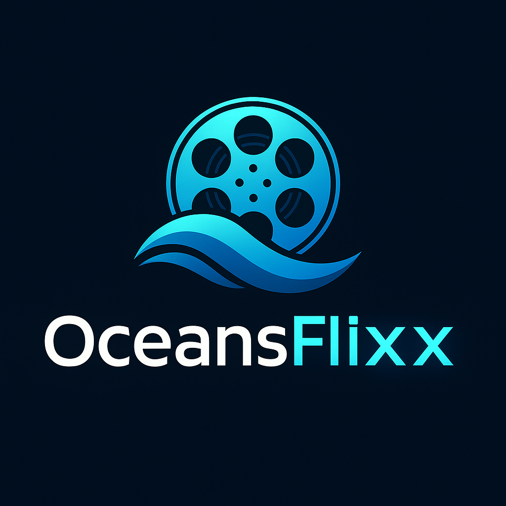

# OceansFlixx - Movie Explorer Application



## 🎬 Project Overview

OceansFlixx is a responsive web application that allows users to search for movies, view details, and discover trending films. The application fetches real-time data from The Movie Database (TMDb) API to provide users with an interactive and engaging movie browsing experience.

### 🔗 Live Demo
[OceansFlixx Live Demo](https://oceansflixx.vercel.app/)

### 📁 Repository
[GitHub Repository](https://github.com/mohrashard/movie-explorer.git)
[GitLab Repository](https://gitlab.com/mohrashard/movie-explorer.git)

## ✨ Features

- **User Authentication**
  - Login and registration system with local storage persistence
  - Protected routes for authenticated users

- **Movie Discovery**
  - Trending movies section displaying popular films
  - Search functionality to find specific movies
  - Infinite scrolling for search results

- **Movie Details**
  - Comprehensive information about each movie (overview, genre, rating)
  - Cast information
  - Embedded trailer viewing
  - Add/remove from favorites

- **User Preferences**
  - Light/Dark mode toggle
  - Save favorite movies (persistent in local storage)
  - Last search query persistence

- **Advanced Features**
  - Filter movies by genre, year, and rating
  - Responsive design for all devices
  - Graceful error handling

## 🛠️ Technologies Used

- **Frontend Framework**
  - React.js (Create React App)
  
- **State Management**
  - React Context API
  - Local Storage for persistence
  
- **UI/UX**
  - Material-UI (MUI) components
  - Custom CSS for enhanced styling
  - Mobile-first responsive design
  
- **Routing**
  - React Router for navigation
  
- **API Integration**
  - Axios for HTTP requests
  - TMDb API for movie data
  
- **Deployment**
  - Vercel for hosting

## 🚀 Getting Started

### Prerequisites

- Node.js (v14 or higher)
- npm or yarn package manager
- TMDb API key (get one at [https://developers.themoviedb.org/3](https://developers.themoviedb.org/3))

### Installation

1. Clone the repository:
   ```bash
   git clone https://github.com/mohrashard/movie-explorer.git
   cd movie-explorer
   ```

2. Install dependencies:
   ```bash
   npm install
   ```

3. Create a `.env` file in the root directory and add your TMDb API key:
   ```
   REACT_APP_TMDB_API_KEY=your_api_key_here
   ```

4. Run the development server:
   ```bash
   npm start
   ```

5. The application will be available at `http://localhost:3000`

## 📂 Project Structure

```
movie-explorer/
├── public/
│   ├── oceanflixlogo.png
│   └── index.html
├── src/
│   ├── components/
│   │   ├── FilterPanel.js
│   │   ├── MovieCard.js
│   │   ├── Navbar.js
│   │   ├── ProtectedRoute.js
│   │   └── SearchBar.js
│   ├── contexts/
│   │   ├── AuthContext.js
│   │   ├── MovieContext.js
│   │   └── ThemeContext.js
│   ├── pages/
│   │   ├── Favorites.js
│   │   ├── Home.js
│   │   ├── Login.js
│   │   ├── MovieDetails.js
│   │   ├── NotFound.js
│   │   └── Register.js
│   ├── services/
│   │   └── api.js
│   ├── utils/
│   │   └── localStorage.js
│   ├── styles/
│   │   └── home.css
│   ├── App.js
│   └── index.js
└── package.json
```

## 🔌 API Integration

The application uses the TMDb API to fetch movie data. All API calls are handled through the `api.js` service which includes:

- `searchMovies(query, page)`: Search for movies based on query
- `getTrending(page)`: Get trending movies for the week
- `getMovieDetails(movieId)`: Get detailed information about a specific movie
- `getMovieCredits(movieId)`: Get cast and crew information
- `getMovieVideos(movieId)`: Get trailers and other video content
- `getMoviesByGenre(genreId, page)`: Get movies filtered by genre
- `getGenres()`: Get list of all genres
- `discoverMovies(params)`: Get movies based on various filters

The API service includes interceptors for request and response handling, with error management and retry capability for network issues.

## 🔒 Authentication

The application uses a simulated authentication system with local storage:

- User registration stores credentials in local storage
- Login validates against stored credentials
- Protected routes ensure only authenticated users access certain pages
- Authentication state is managed through React Context API

## 💾 Local Storage Usage

The application utilizes local storage for:

- User authentication data
- Favorite movies list
- Last search query
- Theme preference (light/dark mode)
- TMDb API key fallback (if not in environment variables)

## 📱 Responsive Design

The application follows mobile-first design principles:

- Adaptive layout for different screen sizes
- Touchscreen-friendly UI elements
- Optimized performance for mobile devices

## 🚢 Deployment

The application is deployed on Vercel:

1. Connect your GitHub repository to Vercel
2. Set up environment variables for the API key
3. Deploy with default settings

## 🧪 Running Tests

To run tests:

```bash
npm test
```

## 📋 Future Enhancements

- User profile customization
- Social sharing functionality
- Advanced filtering and sorting options
- Movie recommendations based on user preferences
- Watchlist feature
- User ratings and reviews

## 📄 License

[MIT License](LICENSE)

## 👨‍💻 Author

Mohamed Rashard
